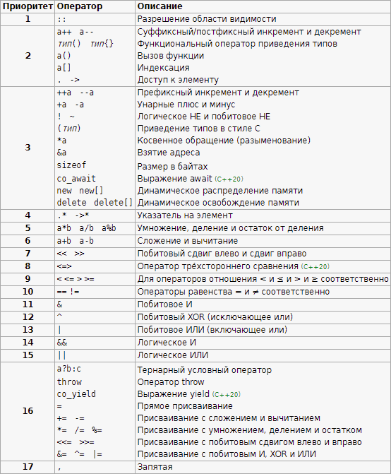

## Практическое занятие №3

### Теоретическая часть
Программист большую часть времени проводит за чтением и модификацией кода, а не за его написанием. В этой связи наибольшую важность набирает аспект "читаемости" кода - чем понятнее код написан, тем проще с ним работать впоследствии. Рассмотрим пример

```cpp
int* a, b;
```
Какого типа переменная "a"? Переменная "b"? Для ответа на этот вопрос нужно довольно глубоко разбираться в особенностях языка Си - что унарная операция * имеет приоритет выше, чем оператор запятая. Нужно вообще знать, что запятая - это оператор, и у неё наименьший приоритет. Вариант ниже работает точно также, но становится очевидно - переменная "a" является указателем на целое число, а "b" - просто целым числом.

```cpp
int *a, b;
```

Компилятор не видит разницы между первым и вторым вариантом объявления переменных. Программисту же эта разница существенна. Набор таких правил форматирования кода называется style guide и содержит некоторую договорённость разработчиков об общих практиках форматирования кода и именования переменных. Многое берут на себя инструменты разработчика - сочетание клавиш Ctrl+Alt+L в CLion приведёт выделенный фрагмент кода к общепринятому форматированию. Соответственно, Ctrl+A поможет выделить весь текст. Сочетание этих двух несложных команд позволяет мгновенно превратить код в "почти конфетку". Чем больше вы будете видеть правильно написанного кода, тем легче вам самому будет его писать.

Для интереса - таблица приоритетов выглядит так. Лучше расставлять скобочки, чем запоминать такую сложную структуру с 17 уровнями.



Важной составляющей частью style guide является подход к расстановке отступов (indentation style). За глубоким чтением отправляю вас к [википедии](https://en.wikipedia.org/wiki/Indentation_style). Одним из распространённых стилей расстановки отступов назван "Стиль «K&R»
" - в честь Кернигана и Ритчи из-за того, что все примеры из их книги «Язык программирования Си» (нередко обозначаемой как просто «K&R» по инициалам авторов) отформатированы подобным образом. Также известен как «kernel style» (BSD KNF; из-за того, что ядро UNIX написано на нём), а также как «Единственный Правильный Скобочный Стиль» (англ. One True Brace Style - 1TBS) со слов его приверженцев. Посмотрим на различные варианты написания конструкции while:

```cpp
# K&R
while (x == y) {
    something();
    somethingelse();
}

# Allman
while (x == y)
{
    something();
    somethingelse();
}

# Horstmann
while (x == y)
{   something();
    somethingelse();
}
```

Вариантов больше, они касаются в том числе именования переменных. Есть выбор между CamelCase и snake_case, и также малое число последователей lowerCamelCase - речь про название переменной как MyVariable, my_variable, myVariable. Основное правило - придерживаться того подхода, который уже есть в коллективе. Тут действует знаменитое армейское правило - лучше единообразно. И никогда самому не смешивать разные стили форматирования и именования переменных. В некоторых языках существуют стандаты уровня языка (PEP8 для Python, gofmt для Golang).

Существует старый holy war пробелы против tab. Авторы никакую сторону принимать не будут. Отметим, что стиль "4 пробела" не значит, что нужно на каждый перенос строки нажимать пробел 4 раза. Нужно настроить свой редактор так, чтобы при нажатии tab вставлялось 4 пробела.

Последний на сегодня фрагмент посвящён правильному именованию переменных и комментариям. В некоторых (особенно отечественных) учебниках насаждается практика бесполезного комментирования каждой строчки кода. Эта практика порочна - комментарии неизбежно устаревают, при изменении кода их меняют редко, в результате образуется рассинхронизация - код про одно, комментарии про другое. Так как код не может врать (именно он выполнится), то хорошо бы помочь прочитать этот код. Рассмотрим пример

```cpp
for (int i = 0; i < 17; i++ ){
    cout << mas[i][3];
}
```
Что делает этот код? Сказать весьма затруднительно. Выводится 17 четвертых значений какого-то массива. Не очень хорошо. Попробуем сделать понятнее

```cpp
// можно было использовать #define N 17
const int n = 17;
const int k = 3;
for (int i = 0; i < n; i++ ){
    cout << mas[i][k];
}
```
Мы вынесли переменные 17 и 3 в именованные константы (или, как сказано в комментариях, можно было воспользоваться макросом). Зачем так? Практика показывает, что такие числа один раз не встречаются. Было 17 объектов - значит, число 17 будет встречаться несколько раз. Если оно определено в одном месте, то его проще заменить (в том числе средствами IDE - refactor - rename). В противном случае нужно глазками отсматривать все числа 17 и заменять их на нужные. А если вы в счётчике цикла решили сразу написать 16 вместо 17-1? Искать придётся среди всего подряд. Но это не единственная причина. Следующая причина - в примере ниже. Ещё раз попробуем:

```cpp
const int students_count = 17;
const int surname_field = 3;
for (int i = 0; i < students_count; i++ ){
    cout << students_array[i][surname_field];
}
```
Наконец код стал понятным! Просто за счёт понятных имён мы привели код в состояние, когда его назначение понятно - пройтись по списку групп, вывести все фамилии (условно, в массиве хранится порядковый номер, имя, отчество, фамилия - и фамилия идёт под номером 3, нумеруем с 0). Можно сделать ещё проще и понятнее, упаковав всё в класс или структуру (в С++ они принципиально пракnически не отличаются).  

```cpp
struct Student {
    std::string name,
    std::string surname
}
```
Благодаря этому мы не только повысим читаемость кода, но и избавимся от лишних переменных (вроде surname_field).

```cpp
const int students_count = 17;
for (int i = 0; i < students_count; i++ ){
    cout << students_array[i].surname;
}
```

Теперь, когда мы имеем класс, представляющий сущность студента, мы можем продвинуться еще дальше и заменить простой массив на один из контейнеров STL (Standart Template Library). Использование контейнеров предоставляет множество методов, значительно упрощающих манипуляцию данными (и читаемость кода, что интересует нас в данном случае).

```cpp
// std::vector<Student> students;
// и не нужно держать никакие переменные для длины массива - контейнер сам хранит эти данные!
for (int i = 0; i < student.size(); i++ ){
    cout << students[i].surname;
}

// можно сделать тоже самое, только с использованием итерраторов - теперь никаких индексов
for (auto student = students.begin(); student != students.end(); student++){
    cout << student.surname;
}

// или использовать range based for, который по сути своей представляет сокращенный вариант цикла, приведенного выше
for (auto student : students){
    cout << student.surname;
}
```


### Кодирование ПО

С использованием CLion необходимо разработать программу, реализующую представленные ниже варианты использования. Фактически это внешняя спецификация программы.

Работать необходимо в том же каталоге куда вы загрузили свой проект с GitLab в ПЗ 2. (По умолчанию это ~/Desktop/timp). **Каталог программы task3**. В дальнейшем необходимо придерживаться такого наименования папок проекта и не допускать различных наименований, чтобы преподаватель не путался во всем разнообразии ваших проектов. В данном случае это 3 задание.

Необходимо отредактировать существующий файл CMаkeLists.txt, **добавив** туда дополнительно информацию о новой конфигурации task3_main в дополнение к example_main и example_test.

**НЕ СОЗДАВАТЬ новый проект в CLion**, а в текущем проекте timp добавить новую конфигурацию task3.

В процессе разработки программы не забывайте периодически (каждые 10 минут) сохранять ее на сервере с использованием команд git.

Разработанная программа будет использоваться при выполнении следующего задания по тестированию. Загрузка кода целиком означает отсутствие использования системы контроля версий Git при своей работе, оценка за это будет снижаться.

Если вы что-то не успели реализовать за отведенное время, то это будет выявлено вами же как ошибка программы при тестировании в рамках следующего задания.

Программа должна состоять минимум из двух файлов:
- task3.cpp (и, возможно, task3.h) - содержит описание и реализацию функций (описаны далее)
- main3.cpp - содержит функцию main и реализацию меню, которое вызывает соответствующие функции.

Кроме этого для проверки программы потребуются дополнительные файлы с данными. Файлы необходимо расположить в подкаталоге **data** каталога task3. Количество файлов и их название - на усмотрение исполнителя.

При выполнении задания **необходимо использовать систему контроля версий Git**, описание каждого коммита **должно** содержать название задания **task3** и смысловое описание изменений в коммите. Следует ориентироваться на коммит каждые 3-5 изменённых строк. Содержимое коммитов должно показывать работу над заданием, если это будет просто загрузка кода кусками, то **оценка будет снижаться**. Система контроля версий - ваш друг. Вы можете спокойно вносить туда разнообразные пробные вещи и "грязный" код, а доводить до ума его в следующих коммитах.
 
**Варианты использования / Внешняя спецификация разрабатываемой программы:**

Программа должна представлять из себя консольное приложение с меню, работающим в бесконечном цикле, меню должно сдержать пункт выхода из программы, а также пункты меню, реализующие нижеприведенные варианты использования. Каждый вариант использования должен быть реализован в виде отдельной функции, которая принимает на вход некоторые значения и возвращает некоторое значение. Ввод необходимых для работы функции значений с клавиатуры и передача их в функцию осуществляется там же, где реализуется само меню (main3.cpp). **Ввод с клавиатуры, и вывод на экран внутри функций запрещен**, работа с функциями только через параметры. **Обратите внимание**, что после запуска программы рабочим каталогом является cmake-build-debug, поэтому относительный путь до файла нужно формировать от этого каталога.

Для вывода на экран использовать стандартные потоки, для работы с файлами использовать файловые потоки.

1. Копирование текстовых файлов. 
- Ввести имя входного и выходного текстового файла. 
- Вызвать функцию копирования файлов
- Вывести на экран количество скопированных строк
- Входные параметры для функции:
    - имя входного файла, файл должен быть текстовым
    - имя выходного файла
- Возвращаемое значение функции:
    - количество скопированных строк или код ошибки (отрицательное число)
- Функция должна производить чтение строк из входного файла и запись в выходной файл. **Если выходной файл не существует**, то он должен создаваться. **Если выходной файл существует**, то информация в него **дописывается**. 

2. Суммирование положительных чисел с плавающей точкой из файла
- Ввести имя входного файла
- Вызвать функцию суммирования чисел из файла
- Вывести на экран сумму чисел
- Входные параметры для функции:
    - имя входного файла, файл должен быть текстовым и содержать положительные числа с плавающей точкой, **разделенные пробелом или переводом строки**, отделение дробной части может быть **как через точку, так и через запятую**. Файл должен содержать только числа в указанном формате.
- Возвращаемое значение функции:
    - сумма чисел из файла или код ошибки (отрицательное число)
- Функция должна просуммировать числа, хранящиеся в файле

3. Шифрование файла. 
- Ввести имя входного и выходного файла
- Ввести ключ шифрования (строка)
- Вызвать функцию шифрования файла с использованием ключа и сохранением в выходной файл
- Вывести на экран количество зашифрованных байт
- Входные параметры для функции
    - имя входного файла
    - имя выходного файла
    - ключ шифрования (строка)
- Возвращаемое значение
    - количество байт, записанных в выходной файл или код ошибки (отрицательное число)
- Функция шифрует входной файл с использованием ключа и операции "исключающее или" (XOR), и записывает результат в выходной файл, при этом **если выходной файл существует, то он перезаписывается**. Ключ необходимо использовать циклически, то есть если, например, ключ состоит из 3-х байт, то первый байт файла шифруется первым байтом ключа, второй - вторым, третий - третьим, четвертый - первым, пятый - вторым и т.д. **Если выходной файл не существует, то он должен создаваться**.

В случае ошибок на экран выводить не только код ошибки, но и текстовое описание. Коды ошибок можно выбрать любые, но они должны позволять различать в дальнейшем ошибки - отсутствие входного или выходного файла, чисел в файле, пустой ключ и т.д.

**Сдачу задания можно осуществлять удаленно**, для этого в подкаталоге **results3** каталога task3, необходимо расположить скриншоты, показывающие работу программы с файлами данных и результатов, при этом из скриншотов должно быть понятно какие файлы используются и данные файлы должны быть в каталоге **data**. Необходимо использовать разные файлы для разных функций, по крайней мере выходные файлы, чтобы результат выполнения функций сохранялся в файлах и следовательно в репозитории. Возможно потребуется несколько скриншотов и файлов для демонстрации работы одной функции, чтобы продемонстрировать **все** требуемые варианты использования по заданию.

**Распространенная ошибка** Не демонстрируется перезапись файла или дописывание в конец. Для возможности демонстрации правильности шифрования третьей функцией необходимо произвести шифрование два раза и использовать три файла: шифрование первого файла во второй, шифрование второго файла в третий. При этом первый и третий файлы должны совпасть (потому что XOR).

Для удаленной сдачи задания создать в **своем** проекте **issue "Сдача task3"** и назначить его преподавателю (Assignee). Без назначения он его не увидит.

Если задание принято, то issue закрывается, если есть замечания, то преподаватель ответит вам в issue и переназначит вам обратно.
