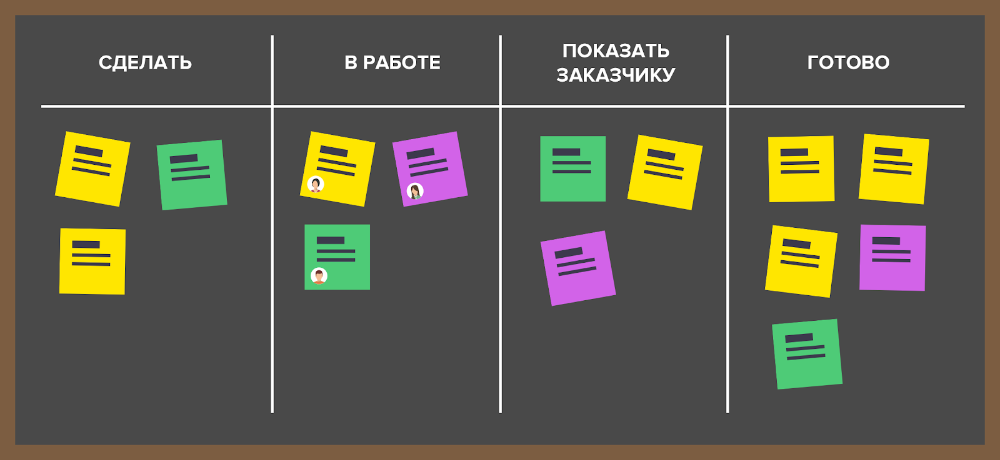

## Практическое занятие №4. Командная работа
### Лирическое отступление
В области производства программных продуктов широко распространена практика командной работы. Небольшие программы возможно разработать в одиночку, но требования по скорости разработки и объёму функционала зачастую диктуют необходимость участия различных специалистов. Программист и дизайнер - уже команда из двух человек, которым необходима коммуникация. С увеличением числа задействованных специалистов возрастают требования к инструментарию, облегчающему взаимодействие.

Пофантазируем — представим, что вы разрабатываете IT-продукт по продаже **корма для собак**. На данный момент вы в команде один. 
Что вы будете делать в первую очередь? Вы задались идеей и, вполне вероятно, что даже составили небольшой и довольно 
грубый план. Вы решаете, что вам необходимо приложение под платформу Android, так как вы прекрасный специалист в области мобильной разработки на Android (а почему бы и нет). Спустя несколько долгих месяцев работы оказывается, что вы даже немного смыслите в дизайне, 
и ваше приложение выдалось вполне удачным. Вы получили первых клиентов (а может и не получили) и осознали, что больш**а**я 
часть потенциальных клиентов "обитает" на платформе iOS. Что вы будете делать теперь?

Что ж, вы прошли через многое и считаете, что изучить Swift и новую платформу для вас совсем не проблема. Вы тратите 
ещё какое-то время на это и вуаля! У вас есть приложение по продаже корма для собак под две основные платформы, и теперь 
дела должны идти в гору, как никогда раньше. Но... как обычно, всё не так гладко. Оказывается, что пока вы реализовывали 
приложение под iOS, пользователи на Android начали стремительно понижать рейтинг приложению из-за множественных ошибок 
и багов. Теперь вы не спите ночами, исправляя все баги и уверяя пользователей, что теперь всё работает прекрасно...
пока ваше приложение на iOS вдруг не упало. 

Хорошо, просидев за разработкой ещё какое-то время, вы сделали приложение довольно стабильным. Теперь пора расширяться, 
ведь конкуренты не дремлют: они сделали себе прекрасный сайт, в связи с чем их количество клиентов существенно выросло! Вы тоже хотите себе сайт, но кто его сделает? Вы не успеваете исправить все баги на мобильных платформах, так ещё 
и собираетесь сайт сами разрабатывать? Наконец, вы осознаете, что вам нужна помощь специалистов в разработке web-сайтов.
Вам нужен кто-то, кто будет следовать той же цели, что и вы, забрав у вас сравнительно большую зону ответственности. 
Теперь вы приветствуете нового члена вашей команды, который будет отвечать за web-разработку и частично заберет на себя 
проблемы с продвижением продукта.

Теперь у вас есть приложение под две мобильные платформы и ваш web-сайт — что дальше? Вы **расширяете** ассортимент. Теперь 
вы продаёте корм для кошек, хомяков, птиц и т.д. У вас появилось огромное количество данных о поставщиках, продажах,
продуктах и даже о покупателях! Вы всё ещё храните данные в одном файлике? Теперь нет. Вы нанимаете в команду 
специалиста баз данных. Данных стало в разы больше, но и то, как это работает, вас теперь тоже не волнует — для этого 
есть свой специалист. Вас волнует лишь то, что обращения к вашей базе должны быть максимально быстрыми, а данные не 
потерялись в случае непреднамеренного сбоя.

Пройдут годы, ваш продукт расширится максимально: вы наймёте аналитиков, чтобы предлагать покупателям товары, которые 
наверняка им подойдут (рекомендательные системы); вы наймёте дизайнеров, чтобы улучшить внешний вид ваших приложений; 
вы наймёте тестировщиков, ведь кто-то должен ещё, помимо клиентов, проверять насколько плохой у вас продукт; вы будете 
нанимать всё больше и больше сотрудников, расширяя способности и сферы деятельности вашего продукта.
Вы будете продолжать это делать, если это будет способствовать успеху вашего продукта.

Что по итогу? Просто вспомните с чего вы начали. Совсем редко когда успешные продукты создаются и поддерживаются одним 
человеком. Вы не всесильны, поэтому вы просто **обязаны** научиться делегировать полномочия.

### Основная часть

Мы с вами сделали это отступление для того, чтобы вы осознали всю важность **командной разработки**. Большинство программных продуктов используют специальные разработанные средства и методологии для ведения удобной, 
масштабируемой и эффективной командной разработки.

> **Совет**: почитать про Agile и Scrum и соответствующие системы ведения проектов и отслеживания ошибок, к примеру, 
> YouTrack и Jira.

В текущем ПЗ мы упростим процесс ведения проектов до одной среды GitLab, с которой вы уже знакомы. Это не говорит о том,
что различные описанные средства не используются в командах из 2-3 человек (скорее наоборот, в основу фреймворка Scrum, 
поддерживаемый, к примеру, Jira, легла идея небольших команд из 3-9 человек), однако для работы в текущих реалиях этого 
более, чем достаточно.

GitLab поддерживает основные инструменты ведения командной разработки: **issues**, **MR** (merge requests), **ветки** (branches)
и даже подобие **Kanban-досок**, часто используемые в командной разработке. 

### Цель
В этом ПЗ необходимо изучить основные аспекты работы с ветками, issues и merge requests, а также канбан-досками на основе issues
в GitLab, применяя это всё в командной разработке.

### Ход занятия

1. **Задание 1**. Перед началом работы вам **необходимо** добавить в свой проект **следующего по списку** слушателя (n+1), с которым вы будете пробовать командную работу над проектом. Вашего одногруппника необходимо добавить с правами **Developer** (подробнее о ролях в проекте можете почитать по ссылке рядом с назначением роли), чтобы он мог 
   создавать MR-запросы (Merge request). Не волнуйтесь, что он может что-то изменить в вашем проекте: любые изменения в
   репозитории будут видны в коммитах. После завершения ПЗ вы **должны** удалить его из членов проекта. На **скриншоте** 
   показать всех членов вашего репозитория (Project information -> Members).
   
1. **Задание 2**. Аналогично **Заданию 1** проверьте, что **предыдущий по списку** слушатель (n-1) добавил вас в свой проект
   с правами **Developer**. Это потребуется для **Задания 6**. На **скриншоте** показать всех членов репозитория 
   слушателя (n-1), где видна ваша роль (Project information -> Members).
   
1. Теперь, когда у вас с вашим напарником есть настроенный проект, давайте поговорим о том, как следует вести совместный 
   проект и как принято их вести в современном IT-мире. Мы будем проводить некую параллель с часто используемой 
   в IT-проектах методологией **Agile**, чтобы вы могли действительно осознать, что мы не занимаемся абстрактными 
   ненужными вещами. Естественно, всё изложенное в этом ПЗ является некоторым упрощением реальных процессов обсуждения проблем, 
   ведения репозиториев, процессов руководства командой и т.п., но даже это достаточно для того, чтобы **разумно** вести командную разработку.
   
   > **Рекомендация**: не пренебрегайте **советом** выше и посмотрите видео на YouTube про Agile и Scrum.  
   > * Исчерпывающее и точное определение и объяснение всех процессов Agile: **"Agile & Scrum – знакомство и легкое погружение" (канал "ITVDN")**
   > * Более краткое объяснение Agile: **"Кратко: что такое Agile (аджайл) - Имми Йалиан" (канал "Социократия в России")**
   
1. Итак, вернемся к [началу](#лирическое-отступление) и вашему зоомагазину. Допустим, у вас уже имеется Android-приложение и сейчас
   вам нужно предугадать некоторые пожелания ваших клиентов или, возможно, подумать какие "фичи" вы хотели бы 
   добавить в приложение. В Agile и Scrum подобные пожелания принято называть **пользовательскими историями**, 
   а то, куда эти истории помещают - **бэклогом**. По-простому, это подобно случаю, когда вы продумываете на человеческом
   языке функции, которые должна выполнять ваша программа, и записываете все ваши мысли (пользовательские истории) 
   в специальный блокнот (бэклог). Впоследствии при разработке программного средства (ПС) вы выбираете нужные вам истории 
   в порядке приоритета исполнения из вашего бэклога и превращаете их в формализованный таск (задание).
   Формализованное задание переводит простые мысли и пожелания клиента (те самые пользовательские истории) в удобный и 
   понятный для разработчика язык: в задании чётко пишется то, что необходимо сделать конкретному разработчику; 
   за какой срок; в каком виде и т.п. Очевидно, что одна пользовательская история может подразумевать сразу несколько 
   тасков. К примеру, история "Добавить возможность оставлять отзыв о товаре" может подразумевать сразу несколько тасков: 
   "Разработать дизайн окна отзывов", "Добавление таблицы отзывов в базу данных", "Реализация диалогового окна отзывов" 
   и т.п., каждый из которых назначается **своему** исполнителю в **команде разработки**.
   
1. В GitLab нет поддержки бэклога, пользовательских историй и тасков в удобном виде, потому что для этого есть специальные 
   средства типа Jira (которое, кстати, интегрируется с GitLab и позволяет с лёгкостью взаимодействовать между этими двумя 
   продуктами). Однако, функционал **Issues** и **Kanban-досок** (Issues->Boards) практически полностью могут покрыть этот
   недостаток.
   
   > Перед тем, как перейти к следующему пункту, важно уточнить, что бэклог используется в т.ч. для так называемых **спринтов**.
   > И на самом деле, процесс использования всех этих технологий куда сложнее. Но для этого, опять же, отсылаю вас к руководству
   > по Scrum и Jira.
   
1. Откройте вкладку Issues->Boards слева на панели проекта. Перед вами подобие **Kanban-доски**, которая используется для 
   удобного распределения тасков по их состоянию. Сейчас, скорее всего, у вас только два столбца **Open** и **Closed**, 
   в которые GitLab автоматически помещает открытые и закрытые issues. 
   
   В реальных проектах такие Kanban-доски используются вокруг да около, разве что в Jira они конкретно предназначены для 
   тасков, а не issues, как в GitLab, но логика абсолютно та же. Доски нужны для того, чтобы руководителям проекта, а также 
   и членам проекта было удобно наблюдать за состояние дел по его разработке. На доске отображаются таски, которые 
   ожидают начала работы, находятся в работе, на code review, на тестировании, завершённые и т.д. Количество таких столбцов
   варьируется от проекта к проекту и полностью определяется **рабочим процессом** задач — это некоторый пайплайн, через который 
   проходит любой таск от начала (колонка "Ожидает начала работы") и до конца (колонка "Завершена"). Рабочий процесс можно 
   полностью изменить — этим занимается руководитель проекта.
   
1. На рисунке представлен самый простой схематичный пример Kanban-доски. **Бэклогом** мы по сути можем называть то, что
   определено в столбце "Сделать". Важно только помнить, что бэклог — это всё-таки перечень задач, расположенных в порядке 
   важности, для команды разработчиков, а на Kanban-доске такие задачи не всегда располагаются именно по приоритету. 
   Для простоты давайте считать бэклогом просто "список дел" по всему проекту, упорядоченных по приоритету, а столбец 
   "сделать" на доске в свою очередь может содержать ещё и другие **сопутствующие какой-либо истории из бэклога** таски.

   

1. Сейчас на вашей Kanban-доске всего два столбца. Вы всегда можете изменить количество столбцов, добавив новые. Однако, 
   GitLab создаёт столбцы только на основе **меток** (labels) у issues проекта. Поскольку, изначально у вас нет ни единой метки, 
   создать новые колонки у вас не получится.
   
   **Задание 3**. Создайте метки **backlog**, **code review** и **bug** (Project information -> Labels). 
   Первая метка понадобится для реализации бэклога, описанного ранее. Вторая метка нужна для тех issues, 
   которые вы создаёте, желая, чтобы ваш участок кода был проверен кем-то
   из ваших членов проекта (обычно этим занимается Team Lead проекта или иной старший разработчик). Третья метка нужна 
   для тех issues, которые говорят о наличии бага в каком-либо участке кода. Выберите для каждой метки свой цвет и 
   добавьте описание, что значит конкретная метка. Создайте **новую** Kanban-доску (Issues -> Boards), назвав её вашим **fullname** (близко 
   к левой панели есть **выпадающее меню** рядом с поисковой строкой **"Search or filter results"**, там нажать на 
   **Create new board**). Создайте на ней новых 3 столбца из созданных ранее меток (всего у вас должно быть 5 столбцов).
   
1. Итак, теперь у вас есть своя собственная Kanban-доска, на которой вы с вашим напарником можете вести совместную разработку
   через issues — прекрасно. Теперь вкратце разберем и попрактикуемся на каждой отдельной метке. Начнём с **бэклога**.
   
   Ниже представлено несколько вариантов возможных приложений:
   1. Мобильное приложение для зоомагазина
   2. Мобильное приложение для ставок на спортивные события
   3. Мобильное приложение для онлайн-магазина одежды
   4. Сайт для анонимного общения
   5. Десктоп приложение для ведения проектов команд разработки
   6. Телеграм-бот для поиска книг
   7. Сайт для онлайн-курсов
   8. Приложение на смарт-часы для сна
   
   **Задание 4**. Ваш вариант: `<номер_по_списку> % 8` (очевидно, что для 8-го, 16-го и т.д. — это 8-й вариант). Теперь
   посчитайте вариант одногруппника, идущего **перед** вами по списку (n-1), и составьте **3 пользовательских историй** с
   меткой **backlog** в его проекте для его приложений: опишите то, что вы хотели бы видеть как **клиент**. Перейдите в
   ваш **собственный** проект и посмотрите на доску: если ваш напарник (n+1) сделал всё правильно, то вы должны увидеть 
   3 открытых issues с меткой **backlog** на вашей доске. Вы можете перейти на каждый из открытых issues и ответить на 
   них. **Важно** не забыть при создании issues вашему напарнику назначить роль исполнителя на **него**. На **скриншотах** 
   необходимо показать Kanban-доску **слушателя (n-1)**, на которой видны ваши issues. Необходимо
   также показать на **скриншоте** хотя бы одно описанное вами issue для этого слушателя.
   
   **Задание 5**. Теперь создайте собственный issue, в котором попробуйте более чётко формализовать требования к вашему 
   приложению (возьмите одну из 3-х историй, которые вам прислали). Не забудьте закрыть issue с меткой **backlog**, 
   которую вы трансформировали в открытый issue. Что ж, теперь у вас на доске должно быть открыто 1 issue, 2 в поле 
   **backlog** и 1 в поле **closed**. Вы можете представить, что вы закрыли один из тасков и спокойно перенести ваш issue из
   поля **open** в поле **closed**. На **скриншотах** необходимо показать **вашу** Kanban-доску, на которой уже есть одно
   закрытое issue, а также показать описание созданного вами нового **issue**.
   
   Благодаря заданиям выше вы теперь должны иметь примерное представление о работе с **тасками** и бэклогом, непосредственно
   использующиеся при любой командной разработке. **Важно понять**, что на самом деле никто, конечно, меток **бэклог** 
   не создаёт. Но при всём этом, правила ведения вашего проекта вы устанавливаете сами. Поэтому, вы вольны творить всё 
   что угодно, лишь бы это было удобно всем членам командны.
   
1. Работа с Kanban-досками и issues, естественно, довольное интересное занятие, но в командной разработке есть и другие
   важные средства для достижения общей цели. Сейчас мы поговорим о **Merge requests** и то, зачем они нужны.
   
   Что ж, представим, что вас обязали разработать или зарефакторить какую-то часть вашего общего приложения. Вы создали
   отдельную ветку в репозитории с соответствующим названием, потратили какое-то время, выполнив задание, а сейчас 
   хотите внести изменения в существующий проект, тем самым "слив" вашу ветку с веткой **master** или **main** (раньше 
   все главные ветки по-умолчанию назывались master, но волна "толерантности" добралась даже до этого). Что будем делать — 
   просто сольём ветки? Боюсь, что такого вам в реальных проектах сделать не позволят (хотя бы потому что обычно изменения 
   в мастер-ветку могут вносить только определенные разработчики), а вот merge request вы создать всегда сможете!
   
1. Итак, зачем же всё-таки нужны MR? Вкратце: для того, чтобы вы командой разработки могли обсудить изменяемый в главной 
   ветке код, как-то его прокомментировать, найти проблемы и изъяны, а затем решать — вносить изменения или нет. Ну, 
   то есть формально MR используется для некоторого рефакторинга кода — вносятся новые участки кода или изменяются старые.
   Именно этим мы и займёмся.
   
   > Важно сказать, что в GitLab мёрдж-реквесты принято называть "Merge request", в то время как в GitHub и BitBucket 
   > установлено название "Pull request" (или PR). Естественно, концептуально они никак не отличаются. 
   > Вы можете называть их как угодно. В рамках ПЗ мы будем говорить конкретно о Merge requests.
   
   Всю процедуру MR условно можно представить в виде такой последовательности действий:  
   
   1. Получение нового задания на изменение какого-то участка кода или функционала (в виде нового issue)
   2. Создание новой ветки для внесения изменений
   3. Внесение изменений и "пуш" в эту ветку
   4. В Web-интерфейсе создаём MR и запрашиваем слияние вашей ветки в ветку основной разработки (обычно master, но, 
      вообще говоря, не всегда — *полезно прочитать про Gitflow*)
   5. Обсуждаем слияние с членами команды разработки, получаем от них некоторое ревью (в виде комментариев в MR к конкретным строчкам кода или всему MR в целом)
   6. Отменяем слияние и делаем правки, которые обсудили на 5-м шаге, в нашей ветке
   7. Шаги 4-6 повторяем до тех пор, пока слияние не будет разрешено
   8. Принимаем MR и удаляем созданную ветку разработки (путём выбора галочки delete branch при слиянии)
   

1. **Задание 6**. Теперь давайте запросим нашего напарника по проекту (n+1) помочь нам с рефакторингом. **Создайте** issue
   с меткой **Code review**, поставьте его исполнителем, а в issue опишите участок кода из [ПЗ №3](./pz03-code.md), реализованный вами **самостоятельно**
   (при этом, участок должен быть сравнительно большой), который вы хотели бы вынести на обсуждение. 
   Ваш напарник **должен** создать ветку с названием <N-fullname>, где N - это номер issue для автоматической связи MR и задачей, внести изменения в код 
   (добавить комментарии, изменить код, названия переменных, а просто превосходно будет, если он найдёт в коде ошибки и 
   опишет их при MR) и сделать запрос на слияние в вашу основную ветку. Посмотрите изменения, которые он сделает, обсудите 
   их через сообщения и решите: сливать или нет. **Не забудьте** проделать те же действия самим для человека n-1 по списку.
   После всех слияний не забудьте удалить ветки. На **скриншотах** необходимо показать созданное **вами** issue для другого
   слушателя, где видна метка, описание issue и исполнитель. Также необходимо показать открытый запрос на слияние от слушателя 
   (n+1) с обсуждением участка кода, который он рефакторит. Сделайте ещё один скриншот, где видно сделанный **вами** запрос 
   на слияние для слушателя (n-1) с обсуждением **его** участка кода.
   
1. В GitHub и GitLab есть специальная кнопка с названием **Fork** (вилка, ответвление). **Fork** — это механизм, позволяющий
   сделать копию репозитория, в котором вы эту кнопку нажимаете, в своём профиле. Это по сути своей полностью аналогично 
   созданию новой ветке в вашем проекте. Вполне логичный вопрос, которым вы можете задаться — "а зачем?". Всё дело в том, 
   что новые ветки вы можете создавать только будучи в роли **разработчика** этого проекта (именно поэтому вы без труда 
   создадите новую ветку в **своем** проекте). Но что, если вы захотите внести изменения в какой-нибудь опенсорс проект 
   на GitHub или GitLab? Вот тут вам и поможет кнопка **Fork**. Она копирует весь проект к вам в профиль, а вы можете делать
   с этим проектом всё что угодно. После внесения каких-либо изменений, вы можете отправить разработчику всё тот же 
   **запрос на слияние**, а он в свою очередь, оценив ваши старания и доводы, либо примет его, либо попросит доработать.
   
1. Идея форков и слияний напрямую граничит с идеей open-source проектов: именно так разрабатываются крупные продукты и 
   библиотеки, которым элементарно нет равных в своей нише. Делая форк и отправляя запрос на слияние другим разработчикам 
   в сети, вы получаете не только бесценный опыт (который безусловно ценится во всех командах IT-сферы), но и участвуете 
   в развитии open-source сообщества. 
