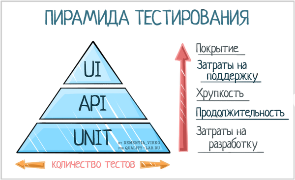

## Практическое занятие №5. Тестирование ПО

### Теория

В ходе этого занятия познакомимся с фреймворком для тестирования Catch2. Версия не существенна, поэтому будем далее говорить просто Catch. Catch - это header-only фреймворк, то есть он не требует установки и распространяется в виде одного заголовочного [файла](src/catch.hpp). Подключили его в проект и используете.

> Обратите внимание: фреймворк является заимствованным названием, корректный русский перевод - программная платформа, что крайне важно знать в защите курсовой работы - там не приветствуется использование англицизмов. Этот перевод, кстати, позволяет легче понять различие фреймворка и библиотеки. 
>
> Библиотека - это код, который используете вы. То есть вы вызываете функции из библиотеки для выполнения какой-то работы. 
>
> Фреймворк (программная платформа) - это код, который использует вас (то есть ваш код). Фреймворк задаёт некоторые правила поведения, добавляет различной магии и в целом облегчает работу - ровно до того момента, пока выполняемая задача входит в область работы фреймворка. Как только вы выходите за его возможности, применение фреймворка связывает вам руки и заставляет применять очень много костылей.


Автоматизированные тесты являются основой устойчивости программного продукта. Легко отладить проект в 100 строчек кода. Представьте теперь в масштабе - что делать с проектом в 10 000 строк кода? За день такое количество строк просто не прочитать, не говоря уже об отладке всего проекта. Из предыдущего занятия вы знаете, что с таким проектом, вероятно, будет работать команда. Пусть 10 разработчиков. Но как разделить между ними области ответственности? Два самых важных помощника в этом
- модульность кода
- юниттесты

Модульность говорит о том, что код должен состоять из модулей, взаимодействующих между собой явным образом. Плохо применять глобальные переменные и знать что-либо о внутреннем устройстве чужого модуля. Если вы вызываете чужой модуль для обработки каких-либо данных, то вам важен формат входных и выходных данных. Реализация же внутри может быть любая - вы предполагаете, что модуль правильно преобразует входные данные в выходные и используете этот модуль для решения своей задачи. 

Юниттесты (также называют модульное или блочное тестирование) же - это тесты уровня модуля (блока кода). Идея состоит в том, чтобы писать тесты для каждой нетривиальной функции или метода, тем самым фиксируя её корректность на некоторых наборах входных и выходных данных. Юниттесты ещё являются отличным дополнением к документации, показывая, что следует ожидать на выходе для заданных входных данных.

В большом программном продукте есть различные типы тестов. Визуально удобно представить эти тесты в виде пирамиды. Внизу пирамиды юниттесты - самые простые в разработке и самые многочисленные тесты для всего подряд. Эти тесты изолированно проверяют корректность отдельных фрагментов кода и, обычно, работают очень быстро (обычно менее 0,1 секунды на тест). Выше идут интеграционные или API-тесты. Это более сложный в разработке вид тестов, который призван убедиться в корректности взаимодействия различных модулей. Запуск таких тестов зачастую требует запуска базы данных и прочих тяжеловесных вещей (отсюда время запуска в районе секунд на тест является приемлемым). Смысл интеграционных тестов - убедиться, что модули корректно взаимодействуют. На верхнем уровне размещаются UI-тесты - для них тестируется всё приложение в сборе, обычно, со стороны пользователя. Нередко эмулируются нажатия кнопочек пользователем, чтобы зафиксировать правильность пользовательский опыт работы с приложением. В результате такие каждый такой тест может выполняться в течение десятков секунд. При этом нужно понимать, что чем быстрее работают тесты, тем проще разработчику.



Особняком стоят нагрузочные (цель - выявить максимальную пропускную способность), стресс (цель - выявить, как будет вести себя продукт в экстремальных условиях, выходящих за рамки рабочих) и другие виды тестов. Они могут быть как отдельно, так внутри пирамиды (например, если высокая пропускная способность - это требование к продукту).

Ваш помощник в написании простых юниттестов - паттерн AAA (Arrange, Act, Assert). Для большинства юниттестов можно четко выделить 3 части кода:
- Arrange (настройка) — в этом блоке кода мы настраиваем тестовое окружение тестируемого юнита, формируем тестовые данные;
- Act — выполнение или вызов тестируемого сценария;
- Assert — проверка того, что тестируемый вызов ведет себя определенным образом.

Этот паттерн улучшает структуру кода и его читабельность, однако начинать писать тест нужно всегда с элемента Act.

Полезный побочный эффект от разработки юниттестов. "Грязный" код с внешними зависямостями, глобальными переменными и подобными проблемами тяжело покрыть тестами. Если тест писать сложно, скорее всего, функция/метод слишком много делает. Чтобы было проще написать тесты, разработчик рефакторит код, в результате чего получает более простой и читаемый код. Тесты должны писаться вместе с кодом, и должны писаться легко. Тесты - ваши друзья, они только первую неделю вызывают трудности. После - они почти полностью заменяют отладку. В отличие от отладки, у тестов есть накопительный эффект - чем больше тестов написано, тем точнее вы знаете поведение кода. Если в коде что-то изменить, то "упадут" конкретные тесты, позволяя очень быстро локализовать проблему.

В рамках этого занятия попробуем писать юниттесты. 

### Описание работы

Для разработанной в рамках задания №3 программы составить набор тестов с использованием фреймворка Catch. 

Файл с тестами должен называться **pz05.cpp** и находиться в каталоге pz05.

**При выполнении задания необходимо использовать систему контроля версий Git**, описание каждого коммита должно начинаться с **pz05** плюс описание изменений в текущем коммите. Частота коммитов на усмотрение разработчика, но содержимое коммитов должно показывать работу над заданием, если это будет просто загрузка кода кусками, то оценка будет снижаться.

**Текущее задание направлено в первую очередь на выявление ошибок, а не на их устранение**. Проверяться будет полнота охвата тестами возможных ситуаций, а не правильность работы программы. **При наличии времени, допускается устранение ошибок в коде pz03**

В CMakeLists.txt необходимо добавить отдельную конфигурацию для тестов "pz05_test", для сборки в CLion должен быть указан тип конфигурации - Catch.

> Обратите внимание, что в настройках конфигурации есть блок Working directory. Если там указать путь до pz05/data, то в тестах можно вводить просто название файла. Либо можно ничего не менять и указывать относительный путь, зная working directory из настроек проекта

Наборы тестов должны быть разбиты на 3 группы - каждая группа для одной функции программы, каждая группа может содержать любое количество наборов тестов (TEST_CASE)

```
Пример:

TEST_CASE("Имя_набора_тестов","[Имя_группы_тестов]")

Один набор тестов может принадлежать нескольким группам

TEST_CASE("Имя набора тестов","[группа1][группа2]")
```

Примеры для типов тестов: верные данные, неверные данные, отсутствие данных. 

Минимальное количество TEST_CASE - три - по одному для каждого типа тестов - итого минимум 9 наборов тестов (три группы по три набора тестов)

Для работы с файлами – неверными данными может быть содержание в файле строк вместо чисел, отсутствие данных – отсутствие файлов, пустой файл.

Для возможности сравнения файлов по содержимому можно реализовать дополнительно функцию **побайтового** сравнения файлов в бинарном режиме открытия, входными параметрами для которой являются имена файлов, а результатом порядковый номер байта с которого файлы отличаются. Если файлы не отличаются, то возвращается 0. Для возможности сравнения должны быть подготовлены **идеальные** файлы, содержащие правильный результат. Функцию для удобства можно разместить в pz05.h, pz05.cpp или создать новый модуль.

Каждое условие (требование), описанное в задании на разработку программы необходимо проверить тестированием несколькими типами тестов.

Файлы (Входные данные) для тестирования должны быть предварительно подготовлены и не меняться в процессе тестирования, файлы хранить в подкаталоге **data** каталога pz05.

Файлы (Выходные данные), появившиеся после прохождения тестирования должны располагаться в том же каталоге, что и входные данные. Необходимо использовать различные выходные файлы для различных тестов, чтобы результат не перезаписывался.

Результат тестирования сохранить в виде скриншотов в issue **pz05** и назначить его преподавателю (Assignee). Без назначения, он его не увидит. Перед каждым скришотом представить его описание. Вставить скриншоты, показывающие результат запуска тестов в CLion, при этом должно быть открыто окно с текущими тестами (pz05.cpp).

Примеры написания тестов можно найти в example, скопированном в задании №2, презентациях лекции или документации по Catch

Если задание принято, то issue закрывается, если есть замечания, то преподаватель ответит вам в issue и переназначит вам обратно.

### Если тесты долго компилируются

Причина долгой компиляции после незначительного изменения - при каждой компиляции тестов производится еще и компиляция catch.hpp, поскольку это header-тесты, а header, как известно, отдельно компилировать нельзя. Функция main из Catch.hpp скрывается за надписью #define CATCH_CONFIG_MAIN в файле тестов.

Для ускорения компиляции необходимо разнести TEST_CASE и catch.hpp по разным файлам.

Например, у вас есть файл test5.cpp
```cpp
...
#define CATCH_CONFIG_MAIN
#include "../catch.hpp"

TEST_CASE(....
```
Необходимо разделить #define и TEST_CASE по разным файлам. Для этого создайте файл,например, test5-main.cpp и перенесите туда строку с #define и скопируйте #include. 

Должно получится так

файл test5-main.cpp
```cpp
#define CATCH_CONFIG_MAIN
#include "../catch.hpp"
```

файл test5.cpp
```cpp
...
#include "../catch.hpp"

TEST_CASE(....
```

Не забудьте включить файл test5-main.cpp в состав конфигурации файла CMakeLists.txt

Теперь при каждой очередной компиляции тестов файл catch.hpp уже не будет компилироваться, будет компилироваться только TEST_CASE. Время компиляции существенно уменьшится.

### Задание
Подготовить не менее 9 наборов тестов (три группы по три набора тестов) в конфигурации с названием "pz05_test". Код в подкаталоге pz05. Скриншотами в задаче **pz05** продемонстрировать 
- окно создания конфигурации
- дерево проекта после ускорения компиляции
- вывод запуска тестов (при этом должно быть открыто окно с текущими тестами pz05.cpp)

Интерес представляет тест, где сравниваются числа с плавающей точкой. В этом сравнении есть свои особенности.
