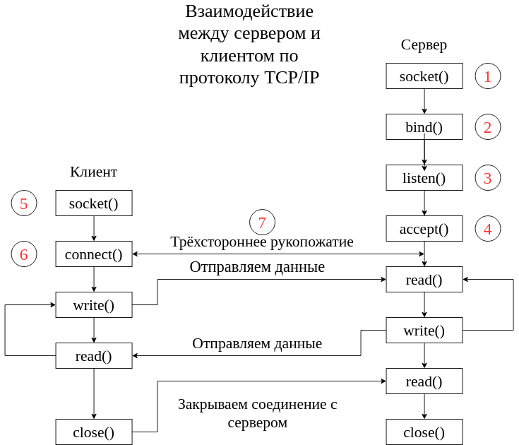
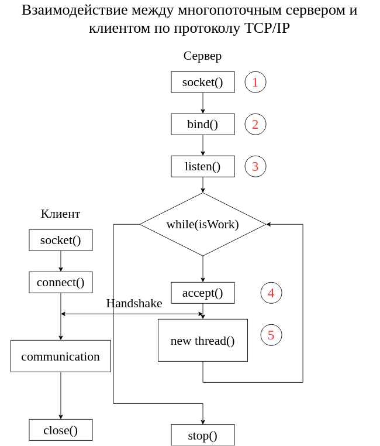

## Практическое занятие №7. Приложения с сетевым взаимодействием

# Отчёт по ПЗ

1. **Скриншот**, на котором виден список подключенных пользователей к серверу в формате {"IP":"","username":""}.
2. **Скриншот**, на котором перечислены все сообщения от всех пользователей отправленные на сервер. Формат сообщений {"IP":"","Message":""}
3. **Скриншот**, на котором перечислены все сообщения от всех пользователей формата многопользовательской рассылки. Формат сообщений {"IP":"","Message":""}

Для взаимодействия по сети компьютеру необходимо специальное обрудование - Сетевая карта. Она взаимодействует с каналом передачи данных: принимает и отправляет данные.
Для каждой сетевой карты характерен уникальный номер - MAC-адрес(физический адрес).

### Стек TCP/IP

TCP/IP — сетевая модель передачи данных, представленных в цифровом виде. Модель описывает способ передачи данных от источника информации к получателю. В модели предполагается прохождение информации через четыре уровня, каждый из которых описывается правилом (протоколом передачи). Наборы правил, решающих задачу по передаче данных, составляют стек протоколов передачи данных, на которых базируется Интернет. 

Название TCP/IP происходит из двух важнейших протоколов семейства — Transmission Control Protocol (TCP) и Internet Protocol (IP), 
которые были первыми разработаны и описаны в данном стандарте. Также изредка упоминается как модель DOD (Department of Defense) в связи с историческим происхождением от сети ARPANET из 1970-х годов (под управлением DARPA, Министерства обороны США). 

Стек протоколов TCP/IP включает в себя 4 уровня:
1. Прикладной уровень(пример: HTTP, RTSP, FTP, DNS)
2. Транспортный уровень(пример: TCP, UDP, SCTP, DCCP)
3. Межсетевой уровень(пример: ICMP)
4. Канальный уровень(пример: Ethernet, IEEE 802.11 WLAN)

#### Прикладной уровень

На прикладном уровне работает большинство сетевых приложений.

Эти программы имеют свои собственные протоколы обмена информацией, например, интернет браузер для протокола HTTP, ftp-клиент для протокола FTP (передача файлов), почтовая программа для протокола SMTP (электронная почта), SSH (безопасное соединение с удалённой машиной), DNS (преобразование символьных имён в IP-адреса) и многие другие. 

#### Транспортный уровень
Протоколы транспортного уровня могут решать проблему негарантированной доставки сообщений («дошло ли сообщение до адресата?»), а также гарантировать правильную последовательность прихода данных. В стеке TCP/IP транспортные протоколы определяют, для какого именно приложения предназначены эти данные.

Протоколы автоматической маршрутизации, логически представленные на этом уровне (поскольку работают поверх IP), на самом деле являются частью протоколов сетевого уровня; например OSPF (IP идентификатор 89).

TCP (IP идентификатор 6) — «гарантированный» транспортный механизм с предварительным установлением соединения, предоставляющий приложению надёжный поток данных, дающий уверенность в безошибочности получаемых данных, перезапрашивающий данные в случае потери и устраняющий дублирование данных. TCP позволяет регулировать нагрузку на сеть, а также уменьшать время ожидания данных при передаче на большие расстояния. Более того, TCP гарантирует, что полученные данные были отправлены точно в такой же последовательности. В этом его главное отличие от UDP.

UDP (IP идентификатор 17) протокол передачи датаграмм без установления соединения. Также его называют протоколом «ненадёжной» передачи, в смысле невозможности удостовериться в доставке сообщения адресату, а также возможного перемешивания пакетов. В приложениях, требующих гарантированной передачи данных, используется протокол TCP.

UDP обычно используется в таких приложениях, как потоковое видео и компьютерные игры, где допускается потеря пакетов, а повторный запрос затруднён или не оправдан, либо в приложениях вида запрос-ответ (например, запросы к DNS), где создание соединения занимает больше ресурсов, чем повторная отправка. 

#### Межсетевой уровень

Межсетевой уровень изначально разработан для передачи данных из одной сети в другую. На этом уровне работают маршрутизаторы, которые перенаправляют пакеты в нужную сеть путём расчёта адреса сети по маске сети. Примерами такого протокола является X.25 и IPC в сети ARPANET.

С развитием концепции глобальной сети в уровень были внесены дополнительные возможности по передаче из любой сети в любую сеть, независимо от протоколов нижнего уровня, а также возможность запрашивать данные от удалённой стороны, например в протоколе ICMP (используется для передачи диагностической информации IP-соединения) и IGMP (используется для управления multicast-потоками).

ICMP и IGMP расположены над IP и должны попасть на следующий — транспортный — уровень, но функционально являются протоколами сетевого уровня, и поэтому их невозможно вписать в модель OSI. 

#### Канальный уровень

Канальный уровень описывает способ кодирования данных для передачи пакета данных на физическом уровне (то есть специальные последовательности бит, определяющих начало и конец пакета данных, а также обеспечивающие помехоустойчивость). Ethernet, например, в полях заголовка пакета содержит указание того, какой машине или машинам в сети предназначен этот пакет. 

### Что будем использовать мы?!

Подробное изучение сетевых технологий будет рассмотрено на 3 курсе. Сейчас разберём материал на необходимом уровне для написания приложения. Взаимодействие по сети будем рассматривать, как две корзины: в первую мы кладём данные для чтения другим пользователем, из второй корзины мы читаем данные, которые нам отправил другой пользователь.

При установлении соединения с другим компьютером по протоколу TCP/IP нам необходимо знать IP адрес компьютера и открытый на нём порт.

За компьютером в сети закреплён всего 1 IP адрес. Но установленных программ на копьютере может быть достаточно много и большинство из них взаимодействует по сети. Для определения программы, которой адресованы принятые данные, используется понятие порта. Порт - число от 0 до 65535. Каждое из этих чисел ассоциировано с 2 файлом, в один из которых записываются данные, а из дургого считываются данные.

При отправке данных программа записывает данные файл, а операционная система считывает записанные данные и отправляет их с помощью сетевого оборудования получателю.
  
При чтении данных сначала система получает данные от оборудования, далее записывает их в файл. После этого прикладная программа может считать адресованные ей данные.

### Протокол TCP/IP

Для более глубокого понимания работы TCP-сервера рассмотрим порядок подключения клиентов к серверу.

Сокет - программный интерфейс, обеспечивающий обмен данными между процессами запущенными как на одной машине, так и на разных.



1. При запуске сервера создаётся экземпляр сокета, который будет прослушивать определённый порт.
2. Далее мы пытаемся "захватить" необходимый нам порт. Так как на машине одновременно может быть запущенно несколько программ, то возможно появление такой ситуации, при которой порт уже занят. Мы считаем,что порт свободен и мы его успешно "захватили" для нашего сервера.
3. Теперь у нас есть всё,чтобы начать прослушивать данный порт: IP-адрес будет соответствовать адресу локальной машины, порт мы задали в предыдущем пункте.
4. Наш сервер готов принимать подключение от клиентов. Он ждёт, когда кто-то отправит запрос на подключение к нему.
5. На стороне клиента мы создаём сокет, с помощью которого мы будет отправлять данные на сервер и принимать данные от сервера. В этот момент мы задаём значение IP-адрес удалённой машины и номер порта, который прослушивает удалённый сервер.
6. Вызов метода connect() означает, что с нашей машины будет отправлен запрос на подключение к удалённому серверу.
7. После отправки запросы стороны приступают к протоколу согласования. Трёхсторонее рукопожатие - процесс, при котором два узла пытаются договориться о начальном числе последовательности пакетов,а также о ряде других переменных, связанных с этим соединением. Числа последовательностей выбираются случайно на обоих сторонах ради безопасности. Клиент генерирует случайное число X и отправляет его серверу(Этот пакет имеет название SYN). Сервер получает данное число, прибавляет 1 к значению Х и генерирует своё случайное число Y. Сервер отправляет клиенту пару чисел (X,Y)(Этот пакет имеет название SYN ACK). Клиент принимает пару чисел, увеличивает значение каждого числа на 1 и отправляет пару (X,Y) серверу. С этого момента считает,что рукопожатие завершено и мы может начать передачу данных.

Как видно из схемы, клиент и сервер могут отправлять друг другу сообщения. Но во время создания клиентского сокета мы указывали только порт и IP-адрес сервера. При создании клиентского сокета по умолчанию используется IP-адрес локальной машины, порт выдаётся системой из списка доступных портов. Во время установления соединения IP-адрес и порт клиента передаётся серверу, поэтому сервер тоже знает все необходимые данные для осуществления взаимодействия.


### Реализация простейшего примера

Для реализации сетевого взаимодействия будем использовать часть библиотеки POCO.

Сервер будет реализован в многопоточном режиме. Это означает,что одновременно через сервер смогут взаимодействовать несколько клиентов.

POCO можно установить командой:
```
sudo apt-get install libpoco-dev
```

Данные будут передаваться в формате json. Для работы с ним будет использоваться библиотека nlohmann/json. Установить данные библиотеку можно с помощью команды:
```
apt-get install nlohman-json3-dev
```

В качестве многопоточного сервера будет использоваться готовый многопоточный сервер, реализованный в библиотеки POCO.

Исходный код [сервера](src/pz07/ClearTCPServer) и [клиента](src/pz07/ClearTCPClient).


#### Алгоритм работы многопоточного сервера

Алгоритм установления соединения будет совпадать с базовым алгоритмом установления соединения по протоколу TCP/IP за исключением следующего момента: как видно из схемы, после установления соединения сервер и клиент могут приступить к процедуре обмена данными, при этом если к серверу захочет подключиться какой-то другой клиент, то он потерпит неудачу,так как сервер сейчас занят и он перешёл он метода захвата соединения(accept) к методу взаимодействия с клиентом. В связи с этим необходимо обеспечить постоянную возможность серверу принимать новые соединения. 

1. Как видно из схемы, первые три шага остаются незменными.
2. Добавился блок While. Задачей данного блога является только захват соединений и создание нового потока для взаимодействия клиента и сервера.
3. В момент создания нового потока для осуществления взаимодействия с новым клиентом мы не блокируем главный поток, он также способен принимать новых клиентов.

Данная схема гарантирует:
1. Каждый новый клиент сможет успешно подключиться к серверу
2. Взаимодействие между каким-либо клиентом и сервером не будет влиять на способность сервера взаимодействовать с другими клиентами.

#### Конкретная реализация на примере использования библиотеки POCO

Рассмотрим применение нашей схемы к конкретной реализации сервера. Будем идти по схему вниз.
```
int main(int argc, char** argv) {

    Poco::Net::ServerSocket svs(1234);

    Poco::Net::TCPServerParams* pParams = new Poco::Net::TCPServerParams();
    pParams->setMaxThreads(4);
    pParams->setMaxQueued(4);
    pParams->setThreadIdleTime(100);

    Poco::Net::TCPServer myServer(new Poco::Net::TCPServerConnectionFactoryImpl<newConnection>(), svs, pParams);
    myServer.start();

    while(true);

    return 0;
}
```
1. Создаём экземпляр класса Сокет, который будет прослушивать определённый порт
2. Далее настраиваем основные параметры сервера.(используйте уже заданные значения,как настройки по умолчанию).
3. Создаём экземляр класса Сервера, который будет взаимодействовать с клиентами. Инициализация экземпляра осуществляется с помощью конструктора из 3 параметров, необходимость передачи первого параметра будет рассмотрена ниже.
4. Теперь у нас есть готовый сервер, который может принимать клиентов и взаимодействовать с ними, осталось только его запустить методом start()
5. Цикл ```while(true);``` небходим,чтобы программа не завершила свою работу. Как можно было догодаться: в момент вызова метода start() создаётся новый поток, который и будет заниматься тем,что захватывать новых клиентов. Таким образом, в данный момент программа содержит два потока: поток main и поток захвата клиентов. 

Теперь вернёмся к пункту 3 и разберём необходимость класса "newConnection". Поток захвата клиентов будем называть "AcceptThread". Как видно из схемы, сейчас захват клиентов осуществляется в AcceptThread. AcceptThread должен быть всё время готов к захвату нового клиента. Таким образом после успешного захвата AcceptThread создаёт новый поток, в котором будет осуществляться взаимодействие между сервером и клиентом. 

```
class newConnection: public Poco::Net::TCPServerConnection {
public:
    newConnection(const Poco::Net::StreamSocket& s) :
            Poco::Net::TCPServerConnection(s) {
    }

    void run() {

        cout << "New connection from: " << socket().peerAddress().host().toString() <<  endl << flush;
        bool isOpen = true;
        Poco::Timespan timeOut(10,0);
        char incommingBuffer[1000];
        while(isOpen){
            if (socket().poll(timeOut,Poco::Net::Socket::SELECT_READ) == false){
                cout << "TIMEOUT!" << endl << flush;
            }
            else{
                cout << "RX EVENT!!! ---> "   << flush;
                int nBytes = -1;

                try {
                    nBytes = socket().receiveBytes(incommingBuffer, sizeof(incommingBuffer));
                }
                catch (Poco::Exception& exc) {
                    cerr << "Network error: " << exc.displayText() << endl;
                    isOpen = false;
                }
                if (nBytes==0){
                    cout << "Client closes connection!" << endl << flush;
                    isOpen = false;
                }
                else{
                    std::string message(incommingBuffer);
                    std::cout<< "Client send message: " << message <<std::endl <<std::flush;

                }
            }
        }
        cout << "Connection finished!" << endl << flush;
    }
};
```
После успешного установления соединения внутри AcceptThread создаётся экземпляр класса newConnection, который описывает новое соединение. Как можно заметить, конструктор класса принимает сокет, который как раз необходим для передачи данных от клиента серверу. Этот сокет "знает" IP-адрес клиентской машины и порт, который прослушивает клиентская программа. После успешной инициализации экземпляра создаётся новый поток, который "запускает" метод run(). Внутри метода run и происходит взаимодействие между клиентом и сервером.

Таким образом мы:
1. Мы запустили сервер и ожиданием подключение со стороны клиентов в новом поток.
2. При подключении нового клиента узнаём всю необходимую информацию о клиенте и запускаем поток взаимодействия с клиентом.
3. Ожиданием подключение нового клиента и повторяем пункт 2.

#### Отправка данных

Теперь мы можем отправлять простейшие данные между сервером и клиентом.
Добавим на стороне клиента функцию: 
```
void SendMessage(Poco::Net::StreamSocket &ss,std::string message){
    nlohmann::json json;
    json["from"] = "server";
    json["message"] = message;
    std::string request = json.dump();
    ss.sendBytes(request.data(),request.length()+1);
}
```

Как упоминалось ранее, данные будут передаваться в формате json. Сначала мы создаём объект json и добавляем необходимые поля, которые должен содержать объект. Далее необходимо предбразовать json в строку, чтобы в дальнейшем получить массив байт для отправки на сервер. На отправку мы передаём массив байт и размер этого массива.

### Задание на самостоятельную работу
С использованием заготовок клиентской и серверной части реализовать следующий функционал:

1. Хранить на сервере список открытых соединений.
2. При получении сообщения сервер должен перенаправлять это же сообщение клиенту и записывать сообщение в файл Log.txt в формате 
```
{
"client":username,
"ip":127.0.0.0,
"port":5678,
"message":"hello world"
}
```
3. При подключении к серверу с машины клиента отправлять имя текущего пользователя ОС.
4. Добавить вариант многопользовательской рассылки, когда одно сообщение будет переслано всем подлюченным клиентам. Хранить данный тип сообщений в файле AllLog.txt

Для проверки преподавателем выполненной работы на стороне сервера реализовать консольное меню:
1. Вывести список открытых соединений на экран: IP-адрес и порт клиентской машины. Для этого на ваш сервер должен подключиться человек предыдущий по журналу. Сделать **скриншот** подключённых пользователей.
2. Вывести файл Log.txt на экран. Сделать **скриншот** отправленных сообщений.
3. Вывести файл AllLog.txt на экран. Сделать **скриншот** выведенных сообщений.

На стороне клиента реализовать консольное меню:
1. Отправка сообщения серверу
2. Вывести список принятых сообщений на экран

